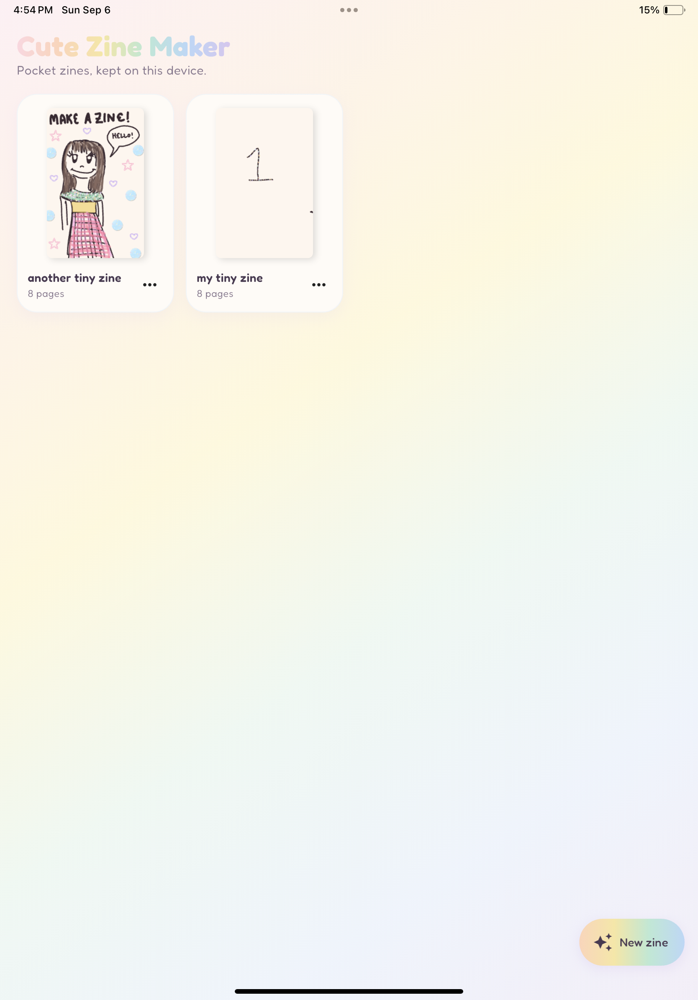
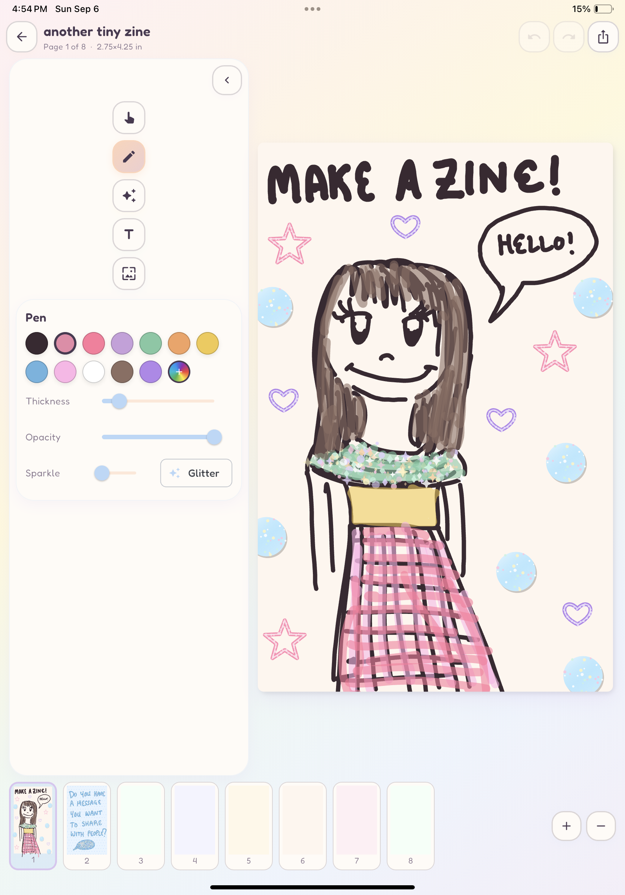
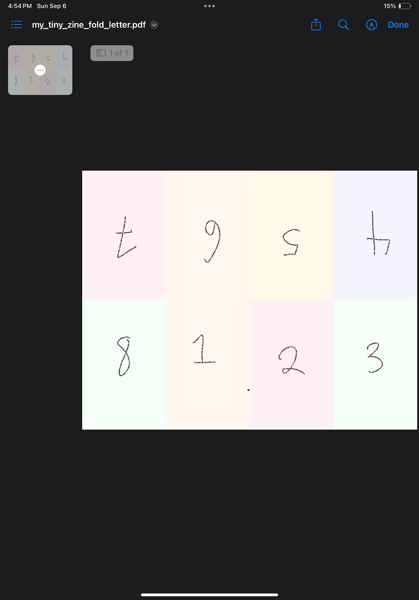

# CuteCursorProjects
Just some little example projects I tried building with Cursor & Grok Bot after first trying them at a hackathon at Hawai'i Tech Week!

## Projects:
- [CuteZineMaker](https://github.com/TheGiraffe/CuteCursorProjects/tree/main/CuteZineMaker)
is a Flutter app that allows you to design your own little zines and download them as a page-by-page booklet or in the traditional 8-page zine layout.

Traditional 8-page layout, which you can then print onto letter (8.5 in x 11 in) sized paper:
